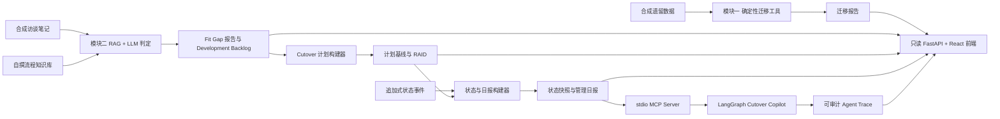

# CarveOps Copilot

CarveOps Copilot 是一个面向企业并购剥离（Carve-out）与 ERP 重建场景的可审计 AI Agent 作品集项目。

项目覆盖三条相互衔接的工作流：

1. 数据迁移映射
2. Fit-to-Standard 差异分析
3. Cutover / RAID 治理

三条工作流均已实现：确定性工具负责业务计算、校验和正式报告生成；本地 stdio MCP Server 提供受控工具接口；LangGraph Agent 只负责规划与编排；FastAPI + React 前端只读展示正式报告和审计轨迹。

核心技术栈包括 Python、Splink、Chroma、DeepSeek/OpenAI/Anthropic Provider 契约、MCP、LangGraph、FastAPI、React、Vite 与 Mantine。项目重点是可解释、可审计、可复现的边界设计，而不是替代企业级 SAP 工具。全部业务数据均为合成数据，不连接真实 SAP 系统，定位为教学和作品集实现。

---

## 项目现在能做什么

| 模块 | 输入 | 核心处理 | 正式输出 |
| -- | -- | ---- | ---- |
| 模块一 · 数据迁移映射 | 合成跨国供应商遗留数据；SAP Business Partner 目标 schema | 数据画像；字段映射；可加载性校验；Splink 实体解析 | `vendor_profile_report.json`、`vendor_field_mapping.json`、`vendor_validation_report.json`、`vendor_duplicate_report.json` |
| 模块二 · Fit-to-Standard 差异分析 | 合成访谈笔记；自撰 SAP 标准流程知识库 | 需求抽取；RAG 检索；Fit / Configuration / Enhancement / Development 判定；独立 ground-truth 评估 | `gap_analysis_report.json`、`gap_analysis_evaluation.json` |
| 模块三 · Cutover / RAID 治理 | 模块二 Development Backlog；`needs_review` 项；追加式状态事件 | Cutover 计划与依赖图；RAID 登记；状态机和审批门校验；管理日报；stdio MCP 工具层；LangGraph Planner Agent | `cutover_plan_report.json`、`cutover_status_report.json`、`cutover_daily_report.json`、`cutover_agent_trace.json` |

---

## 端到端架构



业务状态、RAG、依赖、审批门和管理行动由确定性工具生成。LLM 不重新计算这些业务结论。LangGraph Agent 只把自然语言请求转换成经过 Policy 校验的 MCP tool calls，最终答案由确定性模板组合 MCP 返回结果生成。

---

## 数据安全与"离线"的准确定义

这个项目对"离线 / 合规"的承诺是具体的，下面逐条说明它保证什么、不保证什么。

**保证：**

- **不连接任何真实 SAP 系统。** 代码里没有任何 SAP 系统的连接串、主机名、客户端号或凭据。
- **不调用任何真实 SAP API。** `schemas/` 下的字段结构参考是人工整理自公开 SAP API 文档或公开 metadata 快照，不是从任何 SAP 实例导出的，运行时也不会请求 SAP 服务。
- **不接触任何真实客户数据。** `data/legacy/` 下的全部数据由 `src/tools/generate_legacy_vendors.py` 用 Faker 合成，公司名、地址、税号、银行账号均为伪造值，不对应任何真实实体。
- **不外传任何真实数据。** 项目里根本不存在真实数据可供外传。模块一和模块三确定性工具均只读写本地文件；模块二首次 LLM 判定会把合成访谈文本和自撰知识库片段发送给所选模型 API。

**LLM 判定环节的数据边界（模块二）：**

`src/tools/gap_analysis.py` 默认使用 DeepSeek，也可通过 provider 配置切换 Anthropic 或 OpenAI。首次未命中缓存的运行会把两类内容发送给所选 LLM API：

1. `data/synthetic/interview_notes.json` 里的合成访谈笔记，即虚构的 NewCo 剥离场景、虚构的人名与外部系统名；
2. `data/knowledge/standard_processes.json` 里自撰的 SAP 标准流程知识条目。

红线保护的是真实客户数据，而这里处理的是纯合成数据。因此 README 不声称"不外传任何数据"，只声明"不外传任何真实数据"。

**LLM cache 与离线重放：**

模块二和模块三 Planner 首次请求需要网络和对应 API key。每次 LLM 调用按 provider、model、prompt、schema 和 DeepSeek thinking 参数形成请求指纹，结构化响应缓存到仓库内。后续 `--offline` 只读缓存，cache miss 会明确失败，不会静默联网。

```powershell
$env:DEEPSEEK_API_KEY = "..."   # 仅首次未命中缓存时需要；不要提交真实密钥
python src/tools/gap_analysis.py --provider deepseek --model deepseek-v4-pro
python src/tools/gap_analysis.py --provider deepseek --model deepseek-v4-pro --offline
```

默认 Provider 是 DeepSeek，默认模型是项目当前选定的高能力模型 `deepseek-v4-pro`，默认思考模式为 `enabled`，默认 `reasoning_effort` 为 `high`。DeepSeek 请求会显式发送这些参数，并把它们纳入缓存指纹与报告元数据。Anthropic 与 OpenAI 路径用于 provider 契约兼容，不伪造 DeepSeek 专属字段。

**一个需要说清楚的例外：embedding 模型的一次性下载。**

`src/tools/field_mapping.py` 和知识库构建复用 sentence-transformers 的 `all-MiniLM-L6-v2` 模型。首次运行会从 HuggingFace Hub 下载模型权重并缓存到本地；之后可从本地缓存加载。传输方向是模型权重下载到本机，项目数据不会离开本机。

```powershell
python scripts/prefetch_model.py
python scripts/prefetch_model.py --check
```

模型缓存默认落在 `~/.cache/huggingface`，可用 `HF_HOME` 改。设 `HF_HUB_OFFLINE=1` 可强制禁止任何 Hub 网络请求。

**商标声明：** SAP、S/4HANA 及其它 SAP 产品名称为 SAP SE 的商标。本项目是独立的教学性实现，与 SAP SE 无关联，也未获其背书。

---

## 为什么用合成数据，而不是公开的实体解析基准集

做实体解析（entity resolution）时，用 Leipzig record linkage benchmark、MusicBrainz、DBLP-Scholar 这类公开基准集是常见做法。这个项目没有这么做，原因是它们解决不了这里的核心问题。

**公开基准集不是 SAP 字段结构。** 本项目的重点不是"两条记录是不是同一个实体"这个通用问题，而是遗留字段如何映射到 SAP A2X 的目标 schema：`vendor_name` 该落到 `OrganizationBPName1` 还是 `BusinessPartnerName`？`OrganizationBPName1` 只有 40 字符，超长公司名该溢出到 `Name2` 还是截断？`Country` 是 `CHAR(3)`，`"United States"` 进不去。这些约束只存在于目标 schema 里，通用基准集不具备。

**公开基准集不体现跨国主数据的真实形态。** 德国公司的 `GmbH & Co. KG` 后缀、日本的 `K.K.`、`NNN-NNNN` 邮编、`+49` 电话格式、各国互不相同的税号规则，都是 carve-out 场景中数据质量问题的主要来源，也是"格式一致性检测必须按国家分组"这个结论的由来。

**合成数据同时给了两样东西：精确的 ground truth，和零真实实体的合规性。** `generate_legacy_vendors.py` 在生成脏数据的同时输出 `legacy_vendors_ground_truth.json`（`record_id -> 真实实体 id`），Splink 的 precision/recall 可以精确计算，不依赖人工标注，也不受基准集自身标注噪声影响。而且每条记录都是伪造的，不存在任何真实公司、真实地址或真实税号。

代价是合成数据的脏法是我们自己设计的，可能不覆盖真实世界的全部脏法。这是自觉接受的权衡：本项目要演示的是方法、边界和可解释性，不是刷某个基准集的分数。

### 脏法的设计要经得起"平凡基线"的检验

第一版生成器造重复变体时只改写 `vendor_name` 与 `country`，其余字段整条复制。结果是 `city` / `street` / `postal_code` / `currency` / `created_date` 在每一对真实重复记录中都逐字相同，一句 `GROUP BY postal_code` 就能完美复原 ground truth，Splink 的 F1 也是 1.0，但那度量的是生成器的性质，不是模型的能力。

现在按脏度梯度注入不可逆噪声：名称拼写错误、字符换位、OCR 混淆，地址缩写/展开，邮编错位或缺失，建档日期漂移，联系方式与税号分隔符变化。每条变体抽一个脏度档（`clean` / `moderate` / `dirty`），让下游匹配置信度有分布，`needs_review` 才有内容。

改完之后，标准化后名称仍逐字相同的比例从 100% 降到 44.9%，全部单字段 `GROUP BY` 的 F1 最高只剩 0.8041。生成器的 `_leakage_report()` 每次运行都会打印这张表并给出判词，让泄漏在数据产出的那一刻暴露。

### SAP schema 字段结构参考的核实状态

`schemas/` 下的两个文件不是凭记忆写的。每个字段带 `verification_status`：

- `verified`：已对照一手 `$metadata` 逐字段核对一致（类型、`MaxLength`、`Nullable`、`sap:creatable` / `sap:updatable`）；
- `unverified`：该字段或其所属实体不在核对所用的 metadata 快照中，标注仍来自人工整理。

当前：Business Partner 84/87 verified，Product 61/77 verified。需要注意：这两份 metadata 都是快照，`verified` 的含义是"与该快照一致"，不是"与你所在 SAP release 一致"。真实项目请以自己系统的 `$metadata` 为准。

---

## 目录结构

```text
carveops-copilot/
├── backend/                       # FastAPI 只读报告 API
├── frontend/                      # React + Vite + Mantine 只读界面
├── schemas/                       # SAP 公开字段结构参考
├── data/
│   ├── legacy/                    # 模块一合成遗留数据及评估数据
│   ├── knowledge/                 # 自撰 SAP 标准流程知识库
│   └── synthetic/                 # 正式报告、LLM cache、Agent trace
├── src/
│   ├── tools/                     # 确定性分析和报告构建工具
│   ├── mcp_servers/               # 本地 stdio MCP Server
│   └── agents/                    # LangGraph Agent
├── scripts/                       # smoke test、开发启动和环境脚本
├── tests/                         # Python 测试
└── README.md
```

---

## 安装

```powershell
python -m pip install -r requirements.txt
python -m pip install -r backend/requirements.txt
cd frontend
npm install
cd ..
```

`requirements.txt` 里的 `duckdb` 版本与 Splink 运行稳定性直接相关，不要随意升级；原因写在该文件注释里。前后端依赖分开管理，分析工具不为了跑 UI 拖进 web 框架，API 也不为了跑起来拖进 torch。

**Node 版本注意：** 前端锁的是 Vite 6。Vite 8 与 rolldown 要求更高 Node 版本；在较低 Node 上可能静默跳过原生二进制依赖，构建时才报 `Cannot find native binding`。当前项目用 Vite 6 + rollup 避开这个坑。

---

## 运行方式

### 模块一 · 数据迁移映射

```powershell
python src/tools/generate_legacy_vendors.py
python src/tools/data_profile.py
python src/tools/field_mapping.py
python src/tools/pre_migration_validation.py
python src/tools/entity_resolution.py
```

迁移前校验把两个正交维度分开表达：`semantic_match` 表示映射语义是否正确，`loadable` 表示目标字段是否可写入。典型情形是 `created_date -> CreationDate`：语义正确，但该字段不可创建、不可更新，只能作为 lineage / 参考。

### 模块二 · Fit-to-Standard 差异分析

首次联网生成：

```powershell
$env:DEEPSEEK_API_KEY = "..."
python src/tools/build_knowledge_base.py
python src/tools/gap_analysis.py --provider deepseek --model deepseek-v4-pro
python src/tools/evaluate_gap_analysis.py
```

离线缓存重放：

```powershell
python src/tools/gap_analysis.py --provider deepseek --model deepseek-v4-pro --offline
python src/tools/evaluate_gap_analysis.py
```

不要把模块二首次运行描述成完全离线：首次未命中缓存时需要 LLM API；缓存填充后才可 `--offline` 重放。

### 模块三 · Cutover / RAID 治理

```powershell
python src/tools/build_cutover_plan.py
python src/tools/build_cutover_status.py
python scripts/smoke_test_cutover_mcp.py
python scripts/smoke_test_cutover_agent.py
```

单次 Agent 查询示例：

```powershell
python -m src.agents.cutover_agent `
  --query "是什么阻塞了 Cutover Readiness？" `
  --offline
```

首批正式 Planner cache 已提交；`--offline` 不会调用 DeepSeek。MCP 工具仍通过本地 stdio 执行。状态修改请求会被只读 Policy 拒绝，Agent 不会修改 `cutover_status_updates.json`。

---

## 模块一结果摘要：数据迁移映射

`entity_resolution.py` 用 Splink 4（Fellegi-Sunter 概率匹配）做 `dedupe_only`，在 224 条记录中识别出 50 个疑似重复组（覆盖 123 条记录）。

| cluster 级（只看真实存在重复的 51 组） | precision | recall | F1 |
| --- | --- | --- | --- |
| Splink | 1.0000 | 0.9804 | 0.9901 |
| 最佳平凡基线（`GROUP BY postal_code`） | 0.8478 | 0.7647 | 0.8041 |

按脏度档拆开看：

| 脏度档 | 召回 | 说明 |
| --- | --- | --- |
| `exact_duplicate` | 11/11 = 1.000 | 整条复制 |
| `clean` | 21/21 = 1.000 | 只有可被标准化还原的格式差异 |
| `moderate` | 20/20 = 1.000 | 少量字符噪声 + 地址缩写 |
| `dirty` | 21/22 = 0.955 | 名称被打坏 + 地址/邮编/日期同时变化 |

这份报告保留三处自我拆台，都是刻意的：

- `metric_validity`：用每个字段单独 `GROUP BY` 的 cluster 级 F1 证明指标本身不是泄漏结果；
- `veto_levels`：暴露 EM 对有限样本里"从未不一致"的比较层估出近零 `m` 后产生的一票否决层；
- `borderline_pairs`：列出阈值附近的漏配风险，例如 `Ritter Automation GmbH` vs `ritter autornation gmbh` 的匹配概率 0.9493，低于先验阈值 0.95。

阻断阶段也显式报告 recall 天花板：采用 `name_norm` / `postal_code` / `tax_number` / `email` + `city` + `name_prefix` 后，候选对为 204，占全部 24976 对的 0.8%，理论召回天花板 0.9898。进一步加入 `country_code + legal_form` 可到 1.0000，但候选对放大到 3324，边际收益崩溃，未采用。

EM 训练也有偏倚风险。若用强精确键（`postal_code`、`name_norm`）圈训练样本，圈进来的几乎全是干净重复对，`m` 会被系统性推向"处处一致"，模型对脏对要求过严。当前改用 `name_prefix` + `city` 做 EM 阻断规则；`name_prefix` 不是任何比较器所用列，因此该轮 EM 不固定比较器参数，且候选集中含有更多脏对。这个调整把 `dirty` 档召回从早期 0.55 拉回到 0.95。

---

## 模块二结果摘要：Fit-to-Standard

知识库 `data/knowledge/standard_processes.json` 是 26 条自撰、教学级 SAP 标准流程知识条目，覆盖 P2P、O2C、R2R、master_data 与 cross_cutting。每条切成 4 个 chunk，总计 104 个 chunk，向量化后写入本地 Chroma 派生目录；源知识文件进 git，Chroma 持久化目录作为派生物忽略。

正式结果：

```text
Ground truth requirements = 23
Extracted requirements = 24
Matched = 21
Spurious = 3
Missed = 2
Strict Precision = 0.8750
Strict Recall = 0.9130
Strict F1 = 0.8936
Matched-only classification accuracy = 0.9524
Development Backlog = 5
needs_review = 2
```

分类数量：

```text
Fit = 4
Configuration = 8
Enhancement = 7
Development = 5
```

两个公开限制保留在报告解释里：

1. `REQ-R2R-001` 标准财务能力列表未被抽取；
2. 采购订单审批矩阵虽然被语义抽取，但独立评估的 Jaccard 低于阈值，形成一个 spurious/missed pair。

没有继续针对 ground truth 调参，以避免把正式评估变成答案驱动优化。

---

## 模块三结果摘要：Cutover / RAID 治理

### Cutover 计划基线

```text
Development Backlog = 5
Work packages = 5
Activities = 30
Shared activities = 10
Freeze windows = 3
Approval gates = 4
RAID = 7
Dependency graph acyclic = true
All DEPLOY activities have rollback = true
```

### T-7 执行状态

```text
Events applied = 28
Completed activities = 17
Blocked activities = 2
Not Started activities = 11
Blocked work packages = 1
In Progress work packages = 4
```

### 管理日报

```text
Overall RAG = Red
Critical blockers = 2
Due now = 2
Overdue = 0
Due next = 9
Management actions = 4
```

Red 来自正式确定性日报，不由 README 重新判定。原因是：

- `ACT-EX-024-TEST` 位于 Day-1 关键路径且处于 Blocked；
- `GATE-CUTOVER-READINESS` 在 T-7 到期且处于 Blocked。

---

## MCP 与 LangGraph Agent

### MCP Server

```text
Server name: carveops-cutover
Transport: stdio
SDK: mcp==1.27.2
Tools: 6
```

工具清单：

```text
get_cutover_plan_summary
get_cutover_status_summary
get_cutover_daily_brief
list_cutover_activities
list_raid_items
rebuild_cutover_reports
```

边界：

- 不接受任意路径；
- 不执行 shell；
- 不访问网络；
- 不读取 API Key；
- 不读取 ground truth / evaluation；
- 不提供状态写入工具；
- rebuild 只重建正式 Cutover 报告。

### LangGraph Agent

```text
Graph name: cutover-copilot
LangGraph: 1.2.9
Planner: DeepSeek deepseek-v4-pro
Thinking: enabled
Reasoning effort: high
```

流程：

```text
validate_input
-> plan_request
-> enforce_policy
-> execute_mcp_tools
-> compose_answer
-> validate_output
```

设计边界：

- Planner 只生成结构化计划；
- 独立 Policy Node 验证工具与参数；
- MCP tool result 不再发送给 LLM；
- 最终答案由确定性模板生成；
- 不保存 reasoning content；
- 相同 cache 与报告可稳定离线重放。

六问 smoke 结果：

```text
Planner cache = 6 hit / 0 miss
Unsupported requests = 1
Policy violations = 0
Overall status observed = Red
Blocked activities observed = 2
```

---

## 后端与前端

### 后端

`backend/` 是 FastAPI 只读报告 API，当前显式白名单报告为 10 个：

```text
模块一 = 4
模块二 = 2
模块三 = 4
总计 = 10
```

接口：

| 接口 | 说明 |
| --- | --- |
| `GET /api/health` | 连通性检查；列出报告可用状态 |
| `GET /api/reports` | 报告目录 |
| `GET /api/reports/{name}` | 读取一份白名单报告 JSON |

`{name}` 走显式白名单，不做任何路径拼接。这样避免两类问题：路径穿越（例如 `../../schemas/...`）和评估答案泄漏。以下内容不暴露：

```text
ground truth
evaluation input
Cutover constraints
status event log
Planner cache
formal run trace 目录
任意文件路径
```

报告未生成时返回 404，`detail` 里带 `generated_by`，告诉用户该跑哪个脚本，而不是假装报告存在。

### 前端

React 19 + Vite 6 + Mantine + recharts。三个模块导航均已启用。

```text
frontend/src/
├── api.ts
├── lib/
│   ├── theme.ts
│   ├── reports.ts
│   └── useReport.ts
├── components/
│   ├── ReportGate.tsx
│   ├── StatCard.tsx
│   └── CountryVariantsChart.tsx
└── views/
    ├── ProfileView.tsx
    ├── MappingView.tsx
    ├── ValidationView.tsx
    ├── DuplicateView.tsx
    ├── FitGapView.tsx
    └── CutoverView.tsx
```

`reports.ts` 对所有当前白名单报告建立核心字段类型。模块三页面展示 RAG、活动与工作包、关键阻塞、管理行动、RAID、审批门、冻结窗口、到期事项和只读 Agent trace。前端没有 Agent 输入框，不触发 MCP、LangGraph、rebuild 或状态写入。

图表配色经过对比度和色盲区分度校验，状态色一律配文字标签，不单靠颜色传意。

---

## 快速演示

启动：

```powershell
# 终端一
python -m uvicorn backend.main:app --reload --port 8000

# 终端二
cd frontend
npm run dev
```

访问：

```text
http://127.0.0.1:5173
```

建议演示顺序：

1. 模块一：数据画像、重复供应商和字段映射；
2. 模块二：Fit/Gap 指标、分类明细和 Development Backlog；
3. 模块三：Red RAG、两个关键阻塞和 Cutover Readiness；
4. 展开 `ACT-EX-024-TEST`；
5. 查看 RAID Risk / Dependency；
6. 查看只读 Agent 审计轨迹；
7. 在命令行运行 offline Agent smoke。

---

## 可复现性

合成数据用固定随机种子，正式报告把不可复现的运行元信息隔离在 `_run_info` 区块。`_run_info.content_sha256` 是内容主体 SHA，可直接比对它验证可复现性。

### 确定性工具

相同业务输入得到相同 content SHA。正式模块三 SHA：

```text
plan:
c4a88a3cb0923d2ed28356f72c037ace313ee73bee961ae8212265e4de2a0a8d

status:
093b49b64f5917de0977fd69fdf7b60596d9b84fddbb571a0afba10c7bdb9f6b

daily:
d2b9a4c6318cf78e168f3744cb1681801114ab9c50e5cbba3e0f0050a49999c1
```

模块一曾踩过一个真实坑：EM 在 duckdb 里做并行浮点求和，末位随线程调度抖动，导致报告 SHA 变化。修法是按有效数字舍入后再写入报告，而不是把完整浮点尾数纳入内容主体。

### LLM cache

模块二和模块三 Planner 首次请求需要网络；请求指纹与结构化输出提交到 cache；后续 `--offline` 只读 cache。cache miss 会明确失败，不静默联网。

模块二报告的 content SHA 不包含本次运行的 cache hit/miss 统计，避免在线首次运行和离线重放得到不同业务主体 SHA。运行统计保留在 `_run_info`。

### Agent trace

正式 trace SHA：

```text
688342f8cd89f8c8529c661e50e32c5640c48b7fa4f7035428cf899d0a619419
```

offline、cache hit/miss 和运行节点事件属于运行元数据，不进入 trace 业务主体 SHA。相同计划和 MCP 报告产生相同 trace content SHA。

---

## 项目限制

- 全部业务数据均为合成数据；
- 不连接真实 SAP；
- schema 参考不是完整 S/4HANA 数据模型；
- 模块二知识库是自撰的教学级知识库；
- LLM 评估规模只有 23 条 ground truth requirements；
- Cutover 时间使用 `T-30`、`T0` 等相对 offset；
- 没有真实审批、通知或 SAP 写回；
- 前端完全只读；
- MCP 仅使用本地 stdio；
- Agent 不具备状态写入工具；
- 当前项目重点是架构、审计性和失败边界，不是替代企业级 SAP 工具。

---

## 验证状态

```text
Python unittest: 143 passed
Frontend Vitest: 15 passed
Frontend build: passed
Frontend lint: passed
Backend reports: 10/10
MCP smoke: passed
LangGraph offline smoke: passed
```

当前存在两个非阻塞 warning：

```text
Vite large chunk warning
CountryVariantsChart Fast Refresh warning
```

没有声明 GitHub Actions 已通过，因为当前 README 不以 CI 状态作为证据。

常用验证命令：

```powershell
python scripts/smoke_test_cutover_mcp.py
python scripts/smoke_test_cutover_agent.py
python -m unittest discover -s tests -p "test_*.py" -v

cd frontend
npm test -- --run
npm run build
cd ..

git diff --check
git status --short
```
