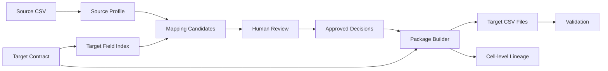

# CarveOps Copilot

CarveOps Copilot is a portfolio project for enterprise carve-out, ERP rebuild, and data migration work.

It started as a set of small checks for legacy data. It now has three connected workflows:

1. Data migration
2. Fit-to-Standard analysis
3. Cutover and RAID tracking

The migration workflow reads a source CSV and a target contract, suggests field mappings, records a reviewer's decisions, and builds target files. The generated package is validated again, and every populated target cell has a lineage record.

A small FastAPI and React app provides the review interface. A reviewer can inspect candidates, approve more than one target for a source field, build the package, preview the output, and inspect validation and lineage results.

All examples use synthetic data. The project does not connect to a real ERP system.

## What It Does

- Profiles source data.
- Validates target contracts.
- Suggests Top-3 field mappings.
- Records human mapping decisions.
- Generates target CSV resources.
- Validates the generated package.
- Stores cell-level lineage.
- Reviews the workflow in a web interface.
- Extracts and classifies process requirements.
- Tracks cutover plans, blockers, and RAID items.

The project is intentionally small enough to inspect. Most outputs are plain JSON, CSV, YAML, or Markdown. The web app reads those outputs through a fixed API instead of hiding them behind a database.

The migration path is the most complete workflow. It starts with a source file and ends with generated target files, a validation report, and lineage. The Fit-to-Standard and cutover workflows provide the surrounding project context: what needs to change, what becomes backlog work, and how that work can be tracked during a cutover window.

## Main Workflows

### Data Migration

The data migration workflow uses a source CSV, a target contract, and a mapping report.

The mapping engine scores candidate target fields for each source field. It returns Top-3 candidates and one preferred recommendation when it has enough confidence. A reviewer still makes the final decision. The package builder only uses approved decisions.

The generated target files are checked against the same contract that defined the target. The builder also writes lineage for each populated target cell. Lineage keeps source field names and source value hashes, not complete source values.

The workflow is contract-driven. A target contract defines resources, fields, primary keys, foreign keys, data types, required fields, value constraints, and project metadata. The same loader is used by validation, mapping, package generation, and workspace preview code. That keeps the example from becoming a set of one-off scripts tied to one input file.

The mapping engine uses field metadata, source profiling, lexical signals, fuzzy matching, semantic similarity, and conservative confidence thresholds. It can make useful suggestions, but the benchmark shows why those suggestions should be reviewed. Top-3 recall is high in the current blind example, while Top-1 accuracy is low. The UI reflects that by treating candidates as review material.

The package builder handles approved one-to-one and one-to-many decisions. It copies values, applies configured constants, applies value maps, and skips rejected rows when a value map says to reject. It writes only after a temporary package has passed validation, so a failed build does not leave a half-written target package in the formal output path.

### Fit-to-Standard

The Fit-to-Standard workflow uses synthetic interview notes and a fixed standard process library.

The analysis extracts requirements, classifies them as Fit, Configuration, Enhancement, or Development, and writes a report. LLM responses are cached. After the cache is populated, the same analysis can run offline and fail clearly if a cache entry is missing.

The evaluation step reads the answer data separately from the extraction and classification path. The report page shows strict extraction metrics and matched-only classification accuracy as different numbers.

This workflow is useful for showing how the project treats model output. The report keeps the extracted requirement, source quote, retrieved process entries, category, confidence, rationale, review flags, and backlog entries. It does not treat a classification as final project scope. Items marked as Development become the input for the cutover planning example.

The current result uses cached structured LLM responses. A first uncached run may need network access and a provider key. Once the cache is populated, offline replay can reproduce the report without sending data to a model provider. The report hash excludes runtime cache hit and miss counts, so an online run and an offline replay can agree on the same business content.

### Cutover And RAID

The cutover workflow starts from the Development Backlog and the standardized migration findings report.

The current pipeline is:

```text
migration source reports
-> migration_cutover_findings.json
-> Cutover RAID and Activities
-> Status Gate and RAG
-> Daily report
```

It builds work packages, activities, dependencies, freeze windows, approval gates, and RAID items. A second tool applies status update events and produces a status snapshot and daily management report.

The formal migration finding inputs are the validation report, duplicate report, field mapping report, and generated package validation report. Blind benchmark accuracy, precision/recall/F1, ground truth, and review-only mapping or duplicate candidates are kept as evidence or review material; they do not become automatic go-live blockers.

There is also a natural-language planner example. It calls local tools through a stdio MCP server. It is a planner layer, not the source of record for cutover data.

The cutover tools are deterministic. The first tool converts backlog items and migration findings into a plan skeleton. The second applies status events to that plan. The output is meant to look like a project control artifact: activity status, package status, approval gates, due-now items, critical blockers, RAID status, and management actions.

The natural-language planner is intentionally narrow. It can ask the local MCP server for summaries, blocked activities, RAID items, and a daily brief. It cannot invent a new plan or write arbitrary files. Rebuild actions are rejected unless they are explicitly allowed by the caller.

Status updates are bound to the current plan by `_meta.source_plan_content_sha256`. If the plan changes, the status event log must be reviewed and rebound before status and daily reports can be rebuilt.

## Migration Workflow



The source profile describes column order, row count, missing values, distinct values, inferred type, and length. The target field index comes from the contract.

The mapping engine gives candidates. The reviewer decides what should be approved, rejected, or deferred. The builder executes the approved result. The generated files are validated with the same contract. Lineage records the source field and a SHA for the source value.

Two boundaries matter here.

First, mapping suggestions and package generation are separate steps. A field can have a plausible candidate and still be rejected or deferred by the reviewer. A required target field can block the package if no approved mapping supplies it.

Second, generated output is checked after it is built. The package is not considered valid just because the decisions were accepted. It must satisfy the target contract, including field order, required fields, primary keys, foreign keys, and value constraints.

The source value hash in lineage helps explain the generated files without copying full values into every trace record. That is enough for this synthetic demo. A real project would need a stronger data handling policy, but the pattern keeps review and traceability separate from raw source exposure.

## Migration Review Workspace

The workspace is fixed:

```text
workspace_id = erpnext-item-price
```

The page lets a reviewer:

- View Top-3 candidates.
- Approve one or more targets.
- Reject or defer a source field.
- Save a Runtime Decision.
- Build the package.
- Preview generated resources.
- Filter lineage.
- Reset local runtime state.

Workspace paths come from a fixed registry. Runtime changes are written under `data/runtime/`, which is ignored by Git. Saving decisions uses optimistic concurrency checks and atomic file replacement.

The current lock is process-local and does not coordinate multiple server processes.

The workspace uses the committed blind benchmark result as its seed. When a reviewer saves decisions, the runtime copy records the mapping report SHA and the previous decision SHA. If either value is stale, the API rejects the write. This prevents a browser tab from overwriting a newer decision file without noticing.

The build action can run from the seed decision or from the runtime decision. The API returns the generated package summary, validation result, and available preview resources. The preview endpoint is read-only. Lineage filtering returns source field names, target cells, row numbers, and hashes rather than raw source values.

The current UI is an MVP. It is good enough to inspect the workflow, change decisions, rebuild the package, and check the output. It does not yet support file upload, workspace creation, reviewer assignment, or a persistent approval log.

## Blind Benchmark

The blind benchmark uses an Item + Item Price target contract.

```text
Domain: Item + Item Price
Contract aliases: 0
Source fields: 10
Expected target links: 11
Source Top-1 accuracy: 0.2222
Top-3 target-link recall: 1.0000
Multi-target full Top-3 coverage: 1.0000
No-target accuracy: 1.0000
High-confidence predictions: 0
```

All expected links appeared within the first three candidates, but the correct target ranked first for only 2 of 9 source fields that had a target. This is why the workspace treats mapping results as review candidates rather than final answers.

The benchmark was run before multi-target execution was added. The original result is kept. After that, a reviewer approved the two multi-target cases and the package builder executed them.

The benchmark is blind in a limited but important sense. The mapping engine does not read the answer file when it produces candidates. The evaluator reads the answer file afterward and compares the candidates to expected target links. This keeps candidate generation separate from scoring.

The numbers should be read carefully. A Top-3 recall of `1.0000` means every expected target link appeared somewhere in the first three candidates. It does not mean the engine selected the right answer by itself. In the current run there were no high-confidence predictions, so high-confidence precision is undefined rather than perfect.

```text
Approved links: 11
Unique approved source fields: 9
Multi-target source fields: 2

item.csv: 8 rows x 5 fields
item_price.csv: 8 rows x 6 fields

Validation: valid
Findings: 0
Lineage entries: 88
```

The two multi-target source fields are:

```text
article_number
-> item.item_code
-> item_price.item_code

inventory_measure
-> item.stock_uom
-> item_price.uom
```

These two fields show why a migration tool needs human-approved one-to-many execution. The same source value can be needed in a master record and in a related price record. The two links were approved by a reviewer from candidate lists; the engine did not decide multi-target intent by itself.

## Project Structure

```text
backend/          FastAPI report and workspace API
frontend/         React app for reports and the review workspace
contracts/        Target contracts used by the migration tools
data/examples/    Synthetic source data, mapping answers, and review decisions
data/generated/   Generated target resources, manifests, and lineage
data/runtime/     Local workspace state; ignored by Git
data/synthetic/   Reports, cached analysis outputs, and benchmark results
docs/             Demo script and reviewer guide
scripts/          Smoke tests and verification script
src/core/         Contract, mapping, and package generation code
src/tools/        CLI wrappers for the core workflows
tests/            Python tests
```

The repository keeps generated examples under version control when they are part of the demo or benchmark. Local workspace changes live under `data/runtime/` and are ignored. The verification script removes runtime state and frontend build output before it finishes.

## Quick Start

### Install

```powershell
python -m pip install -r requirements.txt
python -m pip install -r backend/requirements.txt

cd frontend
npm install
cd ..
```

### Start The API

```powershell
uvicorn backend.main:app --reload --port 8001
```

### Start The Frontend

```powershell
cd frontend
$env:VITE_API_BASE="http://127.0.0.1:8001"
npm run dev
```

Open:

```text
http://127.0.0.1:5173/
```

The default page is `迁移工作台`.

The demo does not require an LLM credential. It uses committed synthetic examples, does not connect to an external ERP system, and does not need the Fit-to-Standard report to be regenerated.

The fastest path through the app is:

1. Open the migration workspace.
2. Review the Top-3 candidates.
3. Save or reset decisions.
4. Build the package.
5. Preview `item.csv` and `item_price.csv`.
6. Filter lineage for `article_number` or `inventory_measure`.

The report pages are read-only. They show the current checked-in analysis outputs for data profiling, Fit-to-Standard, migration cutover findings, cutover planning, cutover status, and the daily cutover report.

The backend exposes reports through a fixed whitelist, not request-built file paths. The current health catalog is `11/11` available and includes `migration_cutover_findings.json`.

## Hash And Provenance Modes

The repository uses three SHA meanings deliberately:

- Raw-file SHA256 is the byte hash of a file exactly as stored.
- `normalized_text_sha256_v1` is used for text provenance where Windows and Unix line endings must describe the same source content.
- Canonical JSON content SHA256 is stored in `_run_info.content_sha256`; it excludes `_run_info` itself and is the value used by downstream report provenance.

Mapping source provenance now records `source_hash_mode: normalized_text_sha256_v1` in the formal mapping report `_meta`. Historical blind protocol evidence remains immutable: `blind_protocol_lock.json` stays fixed, while `blind_protocol_compatibility_amendment_v1.json` authorizes only the provenance-only `src/core/mapping/profiler.py` normalization change and the `src/core/mapping/engine.py` metadata propagation change. Effective lock validation means the historical lock plus that maintenance compatibility amendment is valid; it does not claim the current profiler or engine was part of the original locked-before-first-mapping engine, and scoring logic remains unchanged.

## Rebuild Cutover Reports

```powershell
python src/tools/evaluate_blind_multitarget_mapping.py --mapping-report data/synthetic/erpnext_item_price_blind_mapping.json --ground-truth data/examples/blind/erpnext_item_price/ground_truth.json --protocol-lock data/examples/blind/erpnext_item_price/blind_protocol_lock.json --protocol-amendment data/examples/blind/erpnext_item_price/blind_protocol_compatibility_amendment_v1.json --output data/synthetic/erpnext_item_price_blind_evaluation.json
python -c "import os; os.environ['CARVEOPS_OMIT_TIMESTAMP']='1'; import scripts.smoke_test_multitarget_package_generation as s; s.rebuild_formal_package()"
python src/tools/build_migration_cutover_findings.py
python src/tools/build_cutover_plan.py --migration-findings data/synthetic/migration_cutover_findings.json
python src/tools/build_cutover_status.py
python -m src.agents.cutover_agent --query "当前 Cutover 总体状态怎么样？" --offline --trace-output data/synthetic/cutover_agent_trace.json
```

When the plan SHA changes, update `data/synthetic/cutover_status_updates.json` only after confirming every existing event target still exists in the new plan.

The MCP rebuild path uses the same core generators in this order: migration findings, plan, status, daily. It first builds and validates every report, then stages files beside their targets. Each `os.replace` is a single-file atomic replacement. Ordinary commit failures trigger rollback from per-run backups, but the code does not promise cross-file recovery during process termination, system crash, or power loss.

Current formal content SHA chain:

```text
Blind mapping = 99007ad5da580b6e764b01e3a9739840bcfcff1b1a16c29cf708124ebbc56703
Blind evaluation = e75c2f8e5b6ed7794f265ceb795426045b403d2973a5bc7622af016c887e7527
Protocol compatibility amendment = 2b15b49a87f031312534a28e376345e463de2a3aaae14380150f3c7c0a58888a
Generic manifest = 3915849c255cafa9baf3011e212bb287985d8c20e785e3bbc3baa47aad234c5c
Supplier-reference manifest = 0dcd68ef1422747be95223aacac782735c7cdad59fa2e865a0a36ff8154ff17e
ERPNext manifest = 5c8f6d523a60887ce2b0173e3a89cae94cf484f0212b9cc247c7bd56738d0dfe
ERPNext build report = 02e79b6cf55d898475fd145107da94204cbebed9ddb79d141659cb64862b7af9
ERPNext generated validation = a4c688073df9799a05f5a6d5cba4c584c175c51e7615c87559923efa2b65f012
Migration findings = 74dfc9310502fadaeb4cc27ec31c2e630d0fb97e9dbe645ba3e755d298fbaf60
Cutover plan = 160b1fc7777c71d435eda910686188febb957f21004ae4466f96b08c44c89767
Cutover status = c44900cb3561bfc411664ae7602061ca801faf55587d5eb9b187e096d9b586c5
Cutover daily = e6d095a93a2e05d6b13b7f6d88790d09613dbde1d5f416466df20b0d8e028bd8
Cutover agent trace = ac99965064bd5900686ebbb9cb1762eebdfcf63ba5dff66f45ae82a61e17522d
```

The smoke scripts default to temporary output locations when they are used as tests. The formal rebuild order above is only for controlled artifact maintenance.

## Run The Verification Suite

```powershell
powershell -NoProfile -ExecutionPolicy Bypass -File scripts/verify_practical_v2.ps1
```

Current local verification counts:

```text
Scoped Migration/Cutover tests: 238 passed
Full unittest discovery: 549 tests, 0 failures, 0 errors
Frontend tests: 45
Workspace API tests: 38
```

Full unittest discovery is expected to pass with 0 failures and 0 errors. The scoped Migration/Cutover verification remains the focused evidence for this integration.

The frontend build passed. Frontend lint passed with one existing Fast Refresh warning. `pip check` passed.

The verification script is local. It does not fetch remote data, install dependencies, start servers, or call a model provider. It runs smoke tests, backend tests, workspace API tests, the full Python test suite, frontend tests, frontend build, frontend lint, and dependency checks. It also removes `data/runtime/`, `frontend/dist/`, Python cache directories, and generated runtime byproducts before running `git diff --check`.

## Continuous Integration

[CI runs](https://github.com/KLefiya/Klefiya_Copilot/actions/workflows/ci.yml) cover Linux and Windows Python validation plus the frontend check. The workflow uses Python 3.12, runs full unittest discovery, and checks that the 43 formal generated artifacts are byte-identical before and after the test run. It sets offline model environment variables and does not configure real LLM or API credentials.

The CI workflow pins official GitHub Actions to immutable full commit SHA references to reduce supply-chain risk from movable tags. Human-readable versions remain in inline comments: `actions/checkout` v7.0.1, `actions/setup-python` v7.0.0, and `actions/setup-node` v7.0.0. Future action upgrades still require normal code review and CI verification; Dependabot automation is not configured yet.

Fresh CI runners first bootstrap the public `sentence-transformers/all-MiniLM-L6-v2` files at pinned revision `1110a243fdf4706b3f48f1d95db1a4f5529b4d41`. The bootstrap verifies that the public `main` revision currently resolves to that exact SHA, writes only the local Hugging Face cache ref needed by the production `local_files_only=True` loader, and then verifies local-only loading. The formal Python test step then runs with Hugging Face offline flags, so runtime inference remains local-only and does not use a hosted LLM or API key.

FastAPI 0.139.0 is pinned in the root requirements because backend API and workspace API tests run from the root requirements installation.

The frontend CI job runs from `frontend/package-lock.json` with `npm ci`, then runs lint, 45 frontend tests, and build. Historical blind lock and compatibility amendment checks run through the Python suite on both operating systems. The artifact verification step is configured to run even when Python tests fail, as long as the pre-test snapshot was created.

Local equivalents:

```powershell
python scripts/verify_formal_artifacts_immutable.py snapshot
python -m unittest discover tests
python scripts/verify_formal_artifacts_immutable.py verify
cd frontend
npm ci
npm run lint
npm run test
npm run build
```

## Results

### Migration

```text
Target package: valid
Findings: 0
Lineage entries: 88
```

The generated package contains `item.csv` and `item_price.csv`. The package manifest records resource hashes and the lineage file hash.

The current package is built from human-approved decisions. It has two target resources, sixteen total output rows across those resources, and no validation findings. Every populated target cell has a lineage entry.

### Fit-to-Standard

```text
Ground truth requirements = 23
Extracted requirements = 24
Matched = 21
Spurious = 3
Missed = 2
Strict Precision = 0.8750
Strict Recall = 0.9130
Strict F1 = 0.8936
Matched-only classification accuracy = 0.9524
Development Backlog = 5
needs_review = 2
```

Strict extraction metrics count all extracted requirements. Matched-only classification accuracy is calculated only on aligned requirements.

The Fit-to-Standard report keeps review flags visible. The `needs_review` count is not folded into the accuracy metric. It is a separate signal for requirements that need a person to inspect the extracted wording, evidence, or category.

### Cutover

```text
Migration findings = 22
Migration RAID = 22
Migration Activities = 4
Activities = 34
Completed = 17
Blocked = 2
Not Started = 15
Work packages = 5
Freeze windows = 3
Approval gates = 4
RAID items = 29
Migration blockers = 1
```

The daily report marks the overall state as Red because critical blockers remain open, including one explicit High, non-review-only migration blocker. This is a synthetic demo result, not a real production project status.

The cutover status snapshot is based on 28 update events. It records 17 completed activities, 2 blocked activities, and 15 not started activities. It records 29 RAID items, including 22 migration RAID items and 1 migration blocker. Approval gates are split across 1 approved, 1 blocked, and 2 pending.

## Design Choices

1. Human approval stays between mapping suggestions and package generation. The engine can rank candidates, but it does not decide the migration design.
2. Generated data is validated with the same contract used to define the target. This keeps target shape and validation rules in one place.
3. Lineage records hashes instead of complete source values. The reports can explain where a target cell came from without storing full source values in the lineage file.
4. Evaluation data is kept outside the mapping runtime path. Candidate generation and package generation do not read answer data.
5. Runtime workspace files do not modify committed examples. The workspace can be reset without changing checked-in files.
6. Migration benchmark metrics and ground truth do not feed cutover blockers. Formal blockers come only from traceable migration findings and conservative gate rules.

These choices keep the demo honest. The code can be run locally, the reports can be opened directly, and the tests can check the same files a reviewer sees in the browser. The tradeoff is that the repository is not a configurable platform yet.

## Known Limitations

- Only one workspace is registered.
- There is no upload flow.
- There is no dynamic contract registration.
- There is no database.
- There are no user accounts or reviewer identities.
- The build lock is process-local only.
- The mapping report has one preferred recommendation per source.
- Multi-target execution needs human approval.
- Reference contracts are educational snapshots.
- All business data is synthetic.
- There is no real ERP connection.
- First uncached LLM analysis may require network access.
- This is not a replacement for commercial migration tooling.

The examples are also narrow by design. The current workspace covers one Item + Item Price scenario. The contracts are fixed educational snapshots, not authoritative definitions for every target system. The mapping scorer is useful for candidate discovery, but it still needs reviewer judgement for field meaning, transformation rules, and multi-target intent.

The Fit-to-Standard workflow uses a small synthetic interview set and a small standard process library. Its metrics describe this repository's fixture data only. The cutover workflow uses generated plan and status examples rather than live project management data.
