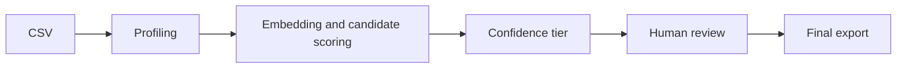

# Dynamic Schema Mapping

Dynamic Schema Mapping is a contract-aware workflow for turning an uploaded source CSV into reviewed field mappings. It is designed for inspection: the system proposes candidates, the reviewer makes final decisions, and exports contain the reviewed result plus enough metadata to understand the original recommendation.

The workflow is separate from the fixed migration workspace documented in the README. Runtime job state is stored in ignored `data/runtime/` folders so local review work does not modify committed examples or formal benchmark artifacts.

## Product Workflow

1. Install Python requirements:

   ```powershell
   python -m pip install -r requirements.txt
   python -m pip install -r backend/requirements.txt
   ```

2. Start the backend:

   ```powershell
   uvicorn backend.main:app --reload --port 8001
   ```

3. Start the frontend:

   ```powershell
   cd frontend
   $env:VITE_API_BASE="http://127.0.0.1:8001"
   npm run dev
   ```

4. Open `http://127.0.0.1:5173/` and select `新建字段映射`.
5. Upload `examples/schema-matching/customer-review-demo.csv`.
6. Choose contract `generic-customer`.
7. Keep the page scorer at `precision_tiered_v5`.
8. Run the mapping job.
9. Review each source field: accept the suggestion, choose one or more targets, or mark it unmapped.
10. Save the review, then download JSON or CSV after all fields are reviewed.
11. To restore saved work, load an Existing Job with its 32-character lowercase hex job id.

The first local model load can be slower because `sentence-transformers/all-MiniLM-L6-v2` is loaded from the local Hugging Face cache. The backend accepts `baseline`, `precision_tiered_v4`, and `precision_tiered_v5`; the runtime dispatcher and CLI default scorer remain `baseline`; the React page explicitly submits `precision_tiered_v5` for this workflow unless the user chooses V4 or baseline.

For a one-command local demo, run:

```powershell
python scripts/run_local_demo.py
```

Optional launcher modes:

```powershell
python scripts/run_local_demo.py --open-browser
python scripts/run_local_demo.py --offline-model
python scripts/run_local_demo.py --smoke-test
```

The launcher checks Python 3.12+, `uvicorn`, Node, `npm`, `frontend/package.json`, `frontend/node_modules`, and the selected backend/frontend ports before starting services. Python 3.12 is the current minimum supported version because `.github/workflows/ci.yml` tests that version and the repository has no lower Python version declaration. It starts the backend with `python -m uvicorn backend.main:app --host 127.0.0.1 --port 8001` by default, then starts the frontend with `npm run dev -- --host 127.0.0.1 --port 5173`, `VITE_API_BASE` pointing at the backend, and `CARVEOPS_CORS_ORIGINS` set to the exact frontend origin. It does not install dependencies or download the embedding model.

`CARVEOPS_CORS_ORIGINS` is comma-separated and accepts only explicit `http` or `https` loopback origins such as `http://127.0.0.1:51987`. It rejects wildcard origins, credentials, paths other than `/`, query strings, fragments, malformed URLs, and public hosts. Without the environment variable, the backend keeps the existing default origins `http://localhost:5173` and `http://127.0.0.1:5173`.

`--offline-model` sets `HF_HUB_OFFLINE=1` and `TRANSFORMERS_OFFLINE=1`. Because the scorer loads `sentence-transformers/all-MiniLM-L6-v2` with local-files-only behavior, a missing local cache means V4 or V5 mapping cannot run until the model cache is prepared; the launcher reports that limitation instead of treating it as success. `--smoke-test` waits for backend and frontend HTTP readiness, probes backend CORS with the actual frontend Origin header, verifies another loopback origin is not allowed, does not create a mapping job, does not run the model, prints `Demo smoke test: PASS`, and then cleans up both child processes. `Ctrl+C`, startup failure, health timeout, and smoke completion all trigger child-process cleanup.

## API Contract

The backend exposes the workflow through these routes:

```text
GET  /api/mapping/contracts
POST /api/mapping/jobs
GET  /api/mapping/jobs?limit=1..100
GET  /api/mapping/jobs/{job_id}
PUT  /api/mapping/jobs/{job_id}/review
GET  /api/mapping/jobs/{job_id}/export?format=json|csv
DELETE /api/mapping/jobs/{job_id}
```

`GET /api/mapping/contracts` returns registered contract summaries and a safe `target_fields` allowlist. For `generic-customer`, the allowlist has 11 stable target fields:

```text
customer.customer_id
customer.customer_name
customer.country
customer.email
customer.phone
customer.tax_number
customer.payment_terms
customer_bank.bank_id
customer_bank.customer_id
customer_bank.iban
customer_bank.currency
```

The catalog response does not expose contract file paths, raw schema file contents, answer data, ground truth, or internal Python objects.

## Runtime Architecture



The runtime path uses a registered contract, writes the uploaded CSV and mapping report into a per-job directory under `data/runtime/mapping_jobs/`, and returns a sanitized job response. Job responses include source field names, source profile summaries, Top-3 candidates, status, confidence, recommendation, and the mapping report content SHA.

The mapping report is created at `POST /api/mapping/jobs`. `PUT /api/mapping/jobs/{job_id}/review` saves a review snapshot against the mapping report SHA. A stale SHA is rejected to avoid overwriting a review for a different mapping report. `GET /api/mapping/jobs/{job_id}` restores the review view without rerunning scoring when a review file exists.

`GET /api/mapping/jobs?limit=1..100` lists recent local jobs from direct children of the server-side runtime root whose directory names are valid 32-character lowercase hex job ids. The endpoint returns only safe metadata: job id, creation time, contract id/title/version, scorer, status, source row and field counts, and an aggregate review status. It sorts by trusted `job.json` creation time newest first, applies the limit after safe filtering, skips malformed jobs, rejects symlink/reparse escape candidates, and does not call scoring, model inference, report regeneration, or evaluation. It never accepts client filesystem paths and never returns raw CSV values, source field names, candidate evidence, decisions, notes, paths, reports, contract file contents, ground truth, or traceback details.

`DELETE /api/mapping/jobs/{job_id}` accepts a typed JSON body with the current `mapping_report_sha256` and returns `204 No Content` on success. The backend never accepts a client-supplied filesystem path or delete directory; it constructs the target from the server-side runtime root plus a validated 32-character lowercase hex job id, rejects symlink/reparse escape candidates, and deletes only that job directory. A stale SHA returns `409 mapping_job_delete_stale`; a busy process-local job lock returns `409 mapping_job_in_progress`; missing jobs return `404 mapping_job_not_found`.

Runtime jobs are local durable working files under ignored `data/runtime/mapping_jobs/`. Explicit deletion removes the uploaded source CSV, `mapping_report.json`, `job.json`, `review.json` when present, and job-local temporary files. It does not remove formal artifacts, contracts, examples, generated package outputs, or any file outside the runtime job directory. The current implementation has no automatic cloud sync, and it should not be described as satisfying complete production compliance or statutory data-retention requirements.

## Ranking

The baseline scorer combines field names, aliases, lexical similarity, semantic similarity, type evidence, and source profiling. The V4 scorer is `precision_tiered_v4` with feature version `precision_tiered_interaction_v1`. It keeps the same ground-truth boundary and adds precision-tiered sparse interactions for selected high-signal concept pairs. The V5 scorer is `precision_tiered_v5` with feature version `entity_identifier_interaction_v1`; it adds a gated entity + identifier interaction on top of V4 so short identifier fields can be reviewed with explicit identifier evidence.

Candidate ranking is evidence for review, not an instruction to build target data. Top-3 candidates remain visible so a reviewer can see why the algorithm suggested a target. Manual target selection uses the full contract `target_fields` allowlist instead of the Top-3 list, because a correct target can be outside the first three candidates.

The CLI with explicit scorer selection is:

```powershell
python src/tools/suggest_runtime_contract_mappings.py --contract contracts/generic_customer/datapackage.yaml --data-root data/examples/generic_customer --source examples/schema-matching/customer-review-demo.csv --output data/runtime/manual-schema-mapping.json --scorer precision_tiered_v5
```

The historical CLI remains available and uses the baseline scorer path:

```powershell
python src/tools/suggest_contract_mappings.py --contract contracts/generic_customer/datapackage.yaml --data-root data/examples/generic_customer --source examples/schema-matching/customer-review-demo.csv --output data/runtime/manual-schema-mapping.json
```

## Ground-Truth Boundary

Ground truth is used only by benchmark evaluation. Candidate generation, feature extraction, scoring, ranking, API job creation, review saving, and export do not read answer files.

The formal V4 artifact records:

```text
ground_truth_runtime_boundary = evaluation_only
ground_truth_used_for_candidate_generation = false
ground_truth_used_for_evaluation = true
ground_truth_used_for_concept_extraction = false
ground_truth_used_for_interaction_activation = false
ground_truth_used_for_tier_decision = false
ground_truth_used_for_scoring = false
```

## Formal Evaluation

The formal V5 metrics are stored in `data/synthetic/schema_matching_precision_tiered_v5_5scenario_evaluation.json`; the V4 artifact remains in `data/synthetic/schema_matching_precision_tiered_v4_5scenario_evaluation.json` for comparison.

```text
Scorer ID: precision_tiered_v5
Feature version: entity_identifier_interaction_v1
Raw SHA-256: f44d07567ed9fa8b199780fff9990d1b577491709433ed554c7140f552386e57
Content SHA-256: 32208506a7ad792a90b78bafeea9fa87c2df4a7a797afcf04cc015009be0a695
V4 comparison raw SHA-256: 49a420b69a2e7c77e15f607bfc1353b15c2bbd7b3bb14da895cbadd76acd4d8b
```

```text
5 scenarios
72 cases
59 single-target
5 multi-target
8 no-target
70 target links
Top-1 accuracy: 0.9322
target recall@1: 0.8429
target recall@3: 0.9857
MRR: 0.9095
no-target accuracy: 0.8750
multi-target full recall@3: 1.0000
```

These numbers come from the repository synthetic/formal evaluation. They are not a guarantee of performance on unseen production data. A separate real runtime smoke check is useful for workflow validation, but it is not mixed into the formal benchmark metrics above.

Useful validation commands for this artifact are:

```powershell
python -m unittest tests.test_schema_matching_benchmark
python scripts/verify_formal_artifacts_immutable.py snapshot
python scripts/verify_formal_artifacts_immutable.py verify
git diff --check
```

## Human Review Example

In a real end-to-end smoke check with the `generic-customer` contract, the source field `client_number` showed an identifier ambiguity:

```text
source field: client_number
algorithm Top-1: customer.phone
Top-3: did not include customer.customer_id
status: needs_review
reviewer decision: customer.customer_id
allowlist source: full 11-field contract target_fields
result: persisted and exported
```

The failure mode is understandable: short identifier-like fields can share weak lexical and value-shape evidence with other compact account or contact fields. The review workflow limits error propagation by keeping confidence/status visible, requiring an explicit reviewer decision, and validating manual targets against the server-provided contract allowlist. This example is not used to tune aliases or hard-code a special case.

## Review And Export Semantics

Review actions are mutually exclusive per source field:

```text
accept_suggestion
select_target
mark_unmapped
```

`select_target` supports one or more target fields from the contract allowlist. `mark_unmapped` clears targets. Notes are optional, limited to 500 characters, and reject control characters.

Partial saves are allowed. Export is blocked with `mapping_review_incomplete` until every source field has a review decision. Completed reviews export JSON or CSV with final mappings, original recommendation, original status, scorer, contract metadata, and the mapping report SHA. Export payloads do not include uploaded row values.

## Example CSV

The example file is `examples/schema-matching/customer-review-demo.csv`. It is synthetic, has 5 data rows, and is not a formal artifact. It intentionally includes `client_number` so a reviewer can demonstrate choosing `customer.customer_id` from the complete contract allowlist even when the desired target is not present in a field's Top-3 evidence.

## Limitations

- Identifier aliases remain ambiguous when short source names and compact values look similar.
- Domain shift can reduce ranking quality when source fields use naming conventions or value patterns absent from the synthetic contracts.
- The first local embedding model load has startup cost.
- Confidence tiers depend on thresholds and evidence distributions; low-confidence cases still require review.
- Synthetic benchmark metrics do not guarantee behavior on private or production datasets.
- Ambiguous fields need human review before export is treated as final.
